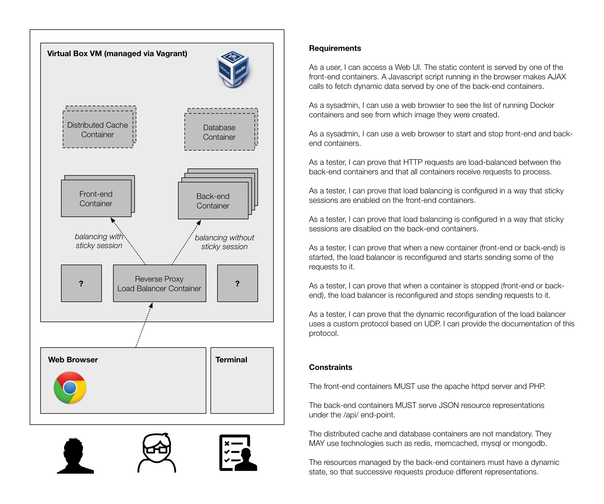

# RES: Web Infrastructure Lab

### Objectives

The main goal of this lab is to learn **how to setup a web infrastructure** and to become familiar with the role of several components (http servers, reverse proxies, load balancers). 

This will be done in a **virtualized environment** based on VirtualBox, Vagrant and Docker. By now, you should already be familiar with these tools, but in the context of the lab you will discover a couple of new features and techniques (e.g. how to share data between containers with volumes).

In addition, in this lab we will come back to the notion of **dynamic service discovery**, which have described in the context of **UDP**. One objective of the lab will be do design a service discovery protocol, which will be used to **be aware of HTTP servers appearing or disappearing from the infrastructure**. In reaction to these events, the **load balancer** should be automatically reconfigured.

### Description of the system to build

The system that we will build in the lab is shown in the following diagram. Three types of users will interact with the system: 

* the **end-users**, who use their browser to **access the web application** deployed on top of the web infrastructure; 

* the **system administrators**, who use their browser to **monitor** the state of the infrastructure (e.g. see the list of running HTTP servers) and to **modify** the infrastructure (e.g. start/stop HTTP servers).

* the **testers**, who must **define and execute a validation strategy** with various **tools** (a browser, tcpdump, a terminal, custom test clients, etc.) to prove that the infrastructure behaves as it should.

The system architecture highlights the following elements:

* the infrastructure is installed in a VirtualBox VM, managed by Vagrant;

* several types of Docker containers (i.e. several images) are used in the infrastructure:

  * One container hosts a server that acts both as **reverse proxy** and **load balancer**. You can chose the server that you like, but we recommend to use **apache httpd** (the main reason is that sticky sessions can be used without any commercial plugin).
  
  * Several containers (based on the same image) host an HTTP server that serves **static content** (html, js, css). We will refer to these containers as the **front-end web servers**. We ask you to use the **apache httpd server** and to write a **PHP** page (so that you can test the HTTP session API). The HTTP requests must be load-balanced between the containers and **sticky sessions** must be enabled.
  
  * Several containers (based the same image) host an HTTP server that serves **dynamic content** (resource representations in json). We call these containers te **back-end web servers**. We recommend that you use **node.js** and **express.js** to implement them. In this case too, the requests must be load-balanced between the containers, but without sticky sessions (the architecture is purely stateless in this case).
  
  * You do not have to worry about **database** and **caching containers**, but of course if you are up to the challenge, these would be a natural extension to the system.
  
  * As you can see, there are a couple of additional types of containers (marked with a '**?**') in the setup. Remember that you have to implement **dynamic discovery** with UDP. Remember that you also have to make it possible for the system administrator to **monitor and configure** the system via a web browser. You will need to use specific components for that purpose.
  
  
### About the Web App

**The focus of the lab is on the web hosting infrastructure, not on the actual web application**. In the previous paragraphs, we have said that end-users would access a web app, which would actually involve front-end and back-end servers. But what do we mean by web app? 

You do not have to implement something very fancy, with a lot of functionality. At the minimum, what you need is:

* to **serve an HTML page**, that will load a **javascript file**. Both files will be served by the web front-end.

* when executed by the browser, the javascript code should **send an AJAX request to the web backend**, retrieve some data and update the DOM. To make testing/demo easier, the returned data should be somewhat dynamic (fetching the same resource several times should return different values).

* **just as an example**, imagine that the backend manages the state of several thermometers (or other sensors). The front-end could return a page that displays the list of thermometers with their name, location and value. It would fetch the data by issue a request to an end-point such as `/api/thermometers`). If the temperatures are generated randomly, you have your dynamic data.

### Guidelines

* Work in groups of **4 students**.

* Each group creates **one and only one fork** of this repo. Other members of the group can then fork the "master" fork for the group.

* In the `README.md`, write the names of all group members.

* In the `README.md`, write the contributions of all group members (who was worked on what parts of the lab).

* **Documentation** should be stored in the repo. We would prefer that you write it in **Markdown** files (so that it can be read online).

### Deliverables & deadlines

* At the end of the lab, we need to be able to clone the "master" fork of the group, do a `vagrant up` and follow the instructions that you provide us in the documentation to test and validate the setup.

* At the end of the lab, we will ask you to do a demo and to explain us how you have designed and implemented the infrastructure. Remember that we expect you to share the tasks, BUT that we expect you to share information: at the end, everyone must be clear on what has been done on all aspects of the lab!

* At the end of the lab, we expect to have a report that documents your design, your implementation choices, the issues that you had to solve. Most importantly, we expect to find a clear description of your validation strategy (how did you verify that the infrastructure works as expected?).

* **We will work on this lab for the next 4 weeks. On May 27th and May 29th, we will ask you to demonstrate your work. On June 1st, we will ask you to submit your final repo and documentation.**

### Resources

* The [express.js](http://expressjs.com/) web framework (used in previous labs, which you can look at for inspiration).

* A **very useful** list of [Docker libraries](https://docs.docker.com/reference/api/remote_api_client_libraries/) and tools.

* Sharing data between Docker containers with [volumes](https://docs.docker.com/userguide/dockervolumes/).

* If you want to talk to the Docker daemon (running on the VM) from a Docker container, read [this](https://docs.docker.com/reference/run/#runtime-privilege-linux-capabilities-and-lxc-configuration).

* The documentation of apache httpd contains information about [reverse proxies](http://httpd.apache.org/docs/2.4/mod/mod_proxy.html), [load balancing](http://httpd.apache.org/docs/2.4/mod/mod_proxy_balancer.html) and [virtual hosts](http://httpd.apache.org/docs/2.4/vhosts/).

* [PM2](https://github.com/Unitech/pm2) is a process manager for Node.js. Useful if you want to run several Node.js scripts in the same Docker container. Also see [this discussion](https://blog.phusion.nl/2015/01/20/baseimage-docker-fat-containers-treating-containers-vms/).

* A nice [companion tool](https://github.com/Tjatse/pm2-gui) for PM2, providing a web ui for it.

* A site that enlists various [template engines](http://garann.github.io/template-chooser/).
